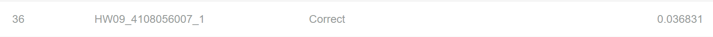
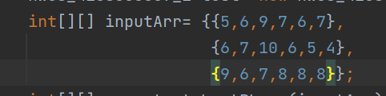
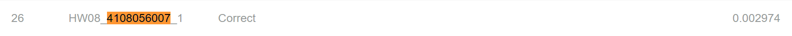
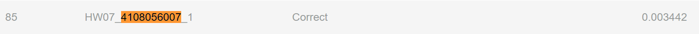
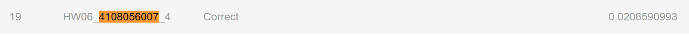

# 109學年下學期 演算法作業
## alghw10 - sorting
```
Your program will take an integer array as input. 
Please return the sorted ascending array in the given array.
Input: [-1,2,5,9,8,7,1,3,2]
Output: [-1,1,2,2,3,5,7,8,9]
```

就是最最最基本的sorting (不提供側資特徵)


## alghw09 - longest shortest path (LSP)
題目:
```diff
Your program will take a two-dimensional integer array as input. 
Each element in the array represents nodes lined together
Please return the longest shortest-path in the given graph.
-Given a graph G = (V, E), find maxu,v d(u, v), where d(u,v) denotes the shortest path length between node u and node v, for all possible u, v
(In this home work, You may use java.util.collection、java.util.ArrayList、java.util.Stack, but  java.util.* is not allowed.)
Input: [[0,1][0,2][0,4][1,3][1,4][2,5][6,7]]
Output: 4
```
一些附加條件: 要在最多node的block中找LSP

簡單來說，就是從所有點中任取兩點(前提是他們有相連)，記錄他們的shortest path，然後從這些長度裡找**最大**的，就是答案

我是參考學長姊的作法，挑出裡面degree最大的node (助教測資給得漂亮，所以我就直接預設找到的這個node在"最多node的block"上)\
從該點出發做BFS，找離它最遠的點(node1)，再從那最遠的點出發，做第二次BFS，找離它最遠的點(node2)\
答案就是node1、node2之間的distance\
(概念像是，我一開始找中間點，第一次BFS去找到邊緣點，第二次找邊緣點到另一端的邊緣點)

排名36\


## alghw08 - buy phone version2
題目:
```
Your program will take a six-dimensional integer array as input. 
Each element represents a smartphone model which contains two features (e.g., screen size and performance ranking).
Please return an sorted array containing a list of unbeatable smartphone models (In other words, filter out the phone models that can be beaten by some model).
The return array should be sorted by the first element of each array in the output. 
Input: [[8,7,7,4,2,1],[2,4,4,6,2,1],[4,0,5,1,3,2],[5,2,4,3,7,3],[7,5,6,9,8,9]]
Output: [[7,5,6,9,8,9],[8,7,7,4,2,1]]
```
上次作業的延伸，只是變成多維版本

概念和上次作業差不多\
先排序(使用stable的sorting，先排最左，依序往右)\
我是設一個陣列max來儲存目前出現過最大的值，往前比較\
若下一個array有任一項大於max，則把該array加入答案，且更新max的值

**這次助教給的側資都很漂亮，所以才不用使用到暴力解，例外測資(如下圖)跑我的code會直接爆掉喔喔喔**\
問了學霸們，他們說如果有這種測資就要暴力解惹




排名26\


## alghw07 - buy phone
```
Your program will take a two-dimensional integer array as input. 
Each element represents a smartphone model which contains two features (e.g., screen size and performance ranking).
Please return an array containing a list of unbeatable smartphone models (In other words, filter out the phone models that can be beat by some model).
Given two items A =(Xa, Ya) and B =(Xb, Yb), Item A beats Item B iff xa≥xb and ya≥yb
Input: [[1,1],[2,4],[2,10],[5,4],[4,8],[5,5],[8,4],[10,2],[10,1]]
Output: [[2,10],[4,8],[5,5],[8,4],[10,2]]
```

先排序(使用stable的sorting，先排最左，依序往右)\
我是設一個int max來儲存目前出現過最大的y，往前比較\
若下一個array有任一項大於max，則把該array加入答案，且更新max的值

因為這次只有二維，所以不會有像hw8的例外情況!
建議可以多觀察助教的測資 <strike>或是跟神人同學要他去後台抓的測資</strike>

排名85(後來有用同學賭一把的寫法，排名2，但正規寫法就是85)\

        
## alghw06 - dessert desert
```
Your program will take an integer arrays as input.
Please return the maximum possible number of blocks in a valid partitioning. 
A valid partitioning of the integer array is defined as follows. 
1. The numbers are split into blocks — groups of consecutive numbers. The blocki,j consists of number ni, ni + 1, ..., nj. A block can have only a single number.
2. Every number belongs to one block only.
3. The partitioning should satisfy the condition that after each block is sorted, the whole sequence becomes sorted as well.
Input: [[1, 1, 1, 1, 1, 1, 1],
        [1, 3, 5, 7, 9],
        [1, 2, 3],
        [5, 4, 3, 2, 1],
        [2, 1, 3, 2]]
Output: [7, 5, 3, 1, 2]
```

排名19\


## ....剩下等有空再更新
